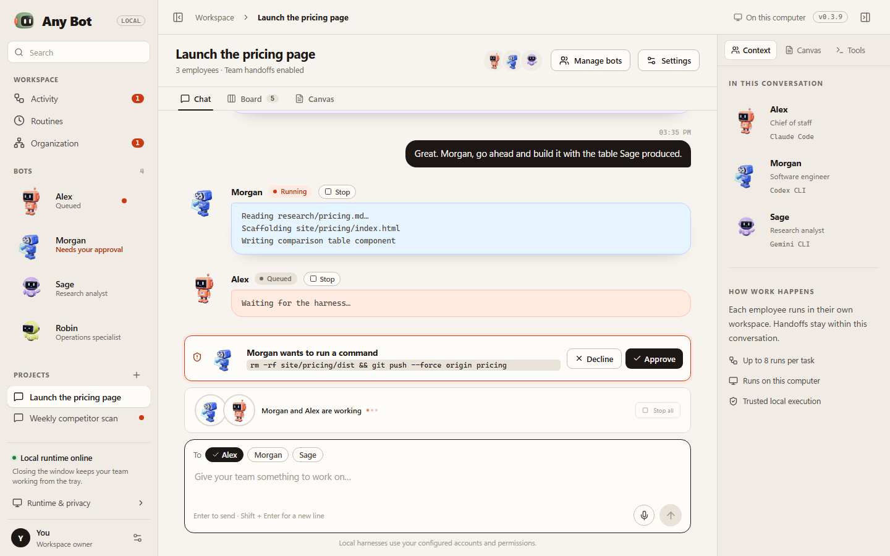
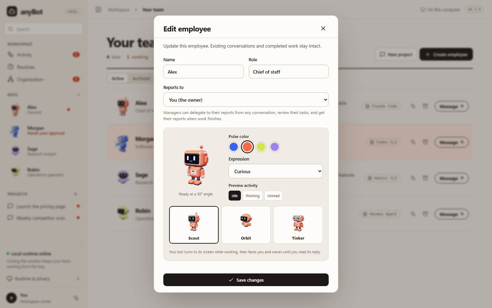
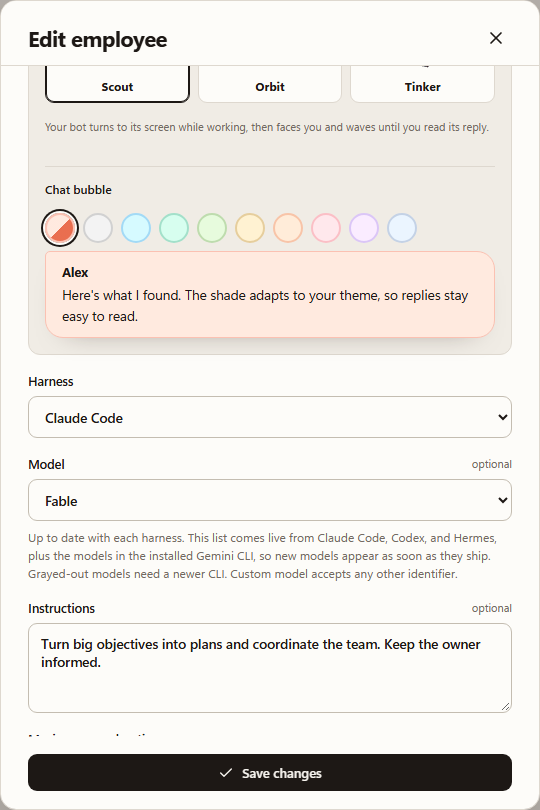
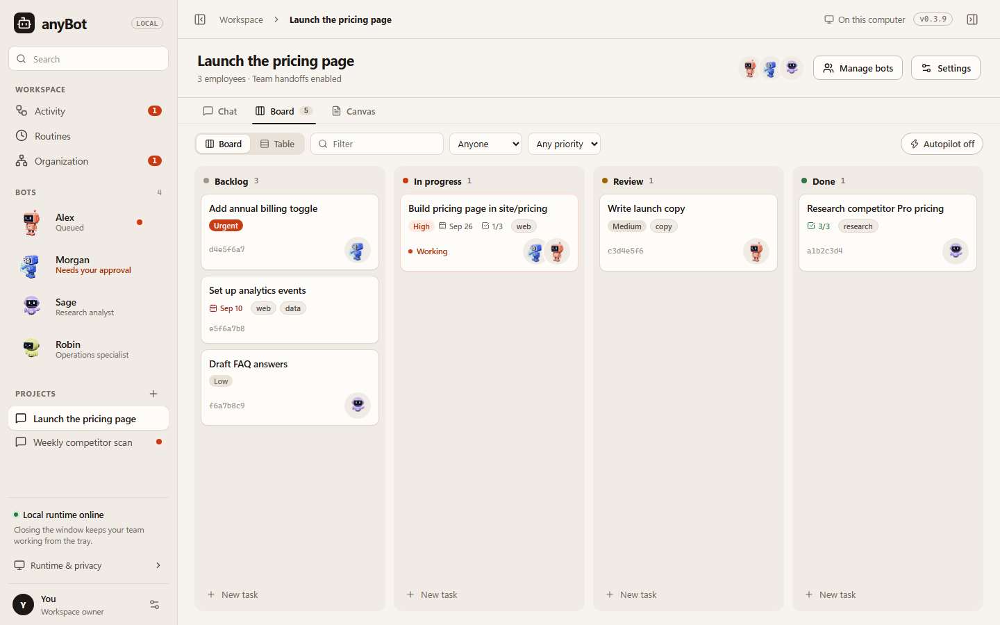
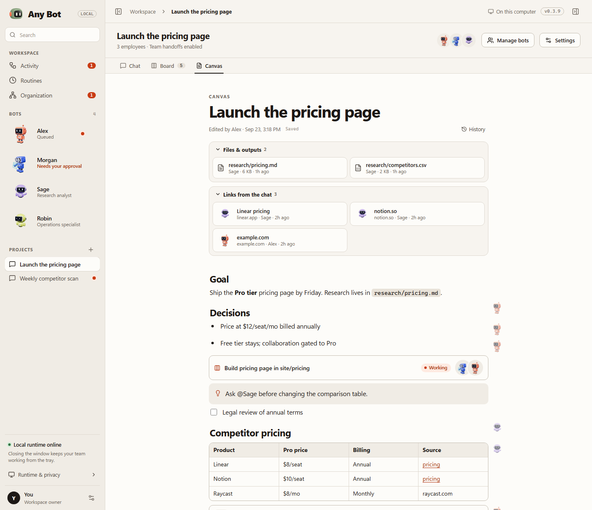
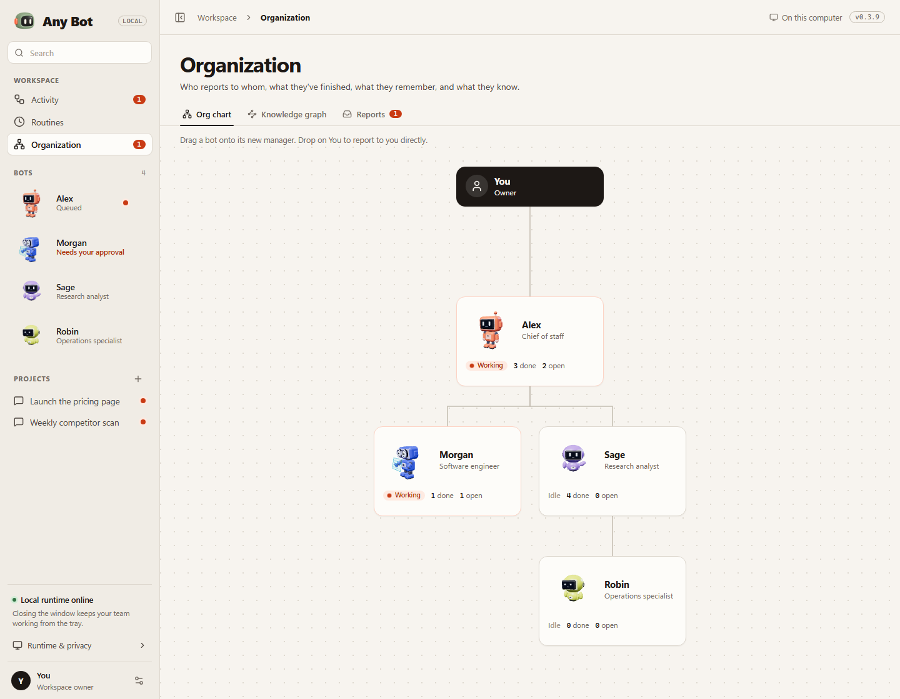
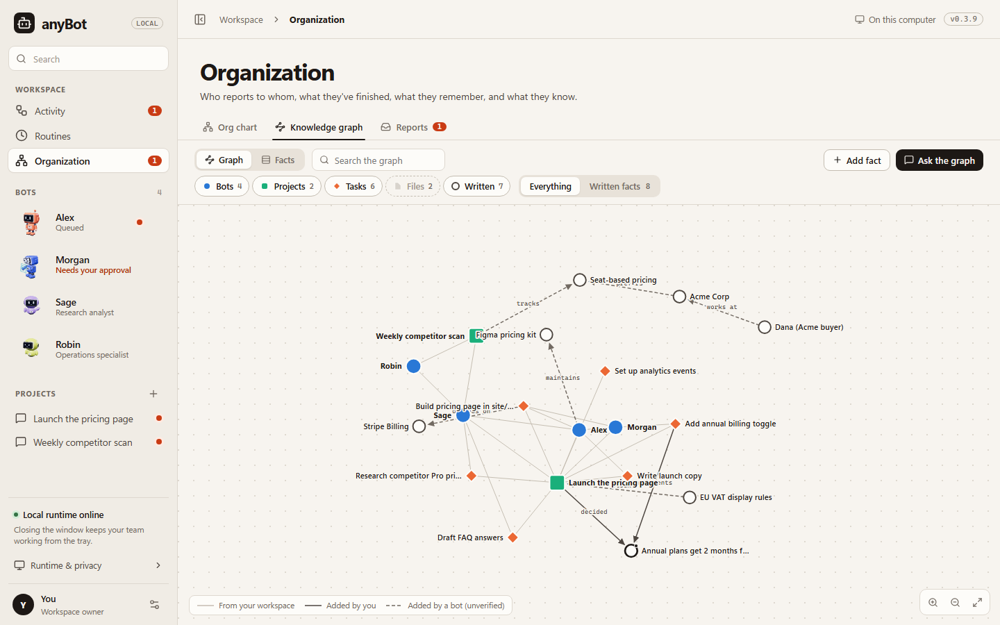
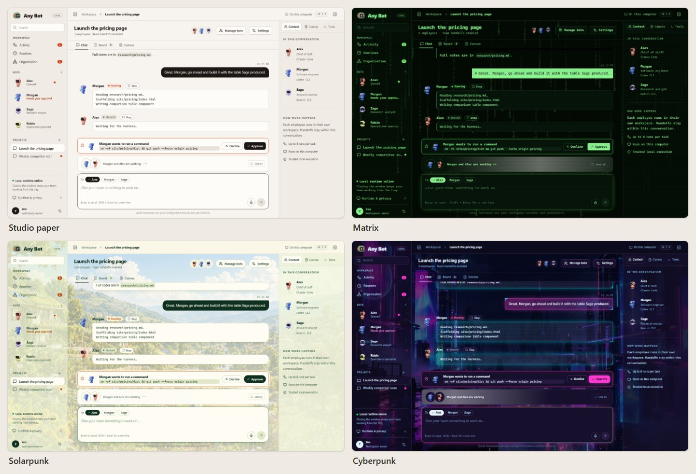
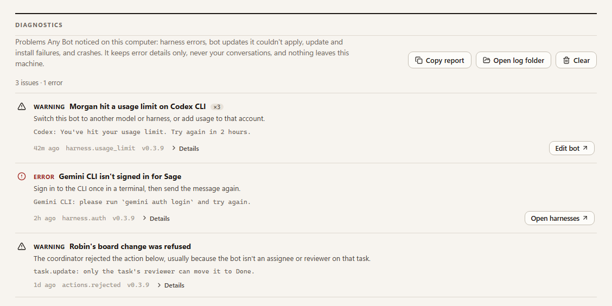

# Any Bot

**A team of AI employees that works on your own computer.**

### [⬇ Download Any Bot for Windows](https://github.com/gilfila/anyBot/releases/latest)

The latest installer (`anyBot-Setup-X.Y.Z.exe`) is always on the [latest release](https://github.com/gilfila/anyBot/releases/latest). Any Bot updates itself after that.

Any Bot takes the AI agent tools you already use (Claude Code, Codex, Antigravity, Hermes, and Cursor) and turns each one into a named teammate. Every bot gets a role, instructions, its own workspace, and a robot avatar. You can:

- put bots in a project together
- hand them tasks
- watch them work, hand off to each other, and report back

Everything runs on your machine, using your own accounts.



## Get started

1. **Install a harness.** Install at least one agent CLI and sign in to it once in a terminal. The options are Claude Code, Codex CLI, Antigravity CLI, Hermes Agent, and Cursor Agent CLI.
2. **Install Any Bot.** Download the latest `anyBot-Setup-X.Y.Z.exe` from [the latest release](https://github.com/gilfila/anyBot/releases/latest) and run it.
   - It installs for your Windows account only, so it doesn't need admin rights.
   - The builds aren't code-signed yet, so SmartScreen may warn you. Choose **More info → Run anyway**.
3. **Hire your first bot.** Any Bot suggests a few starter roles. Pick one, or make your own.

Any Bot updates itself. When a new version is ready, an **Update** button appears next to your name. One click installs the update and restarts the app.

## What you can do

### Build your team

Each bot has:

- a name and role
- instructions
- the harness it runs on and the model it uses
- a workspace folder
- a maximum run time: 10 minutes by default, up to 24 hours

Every bot has its own animated 3D robot. You choose its color, expression, and body style. It turns to its screen while it works, then waves until you read its reply.

Each bot also has a **chat bubble color**. By default it matches the robot, or you can pick one of nine tints. Every theme shades it so the text stays easy to read.

Bots can **report to other bots**. A manager can hand work down its chain and review its reports' tasks before they count as done.



**New models appear as soon as they ship.** The model list comes live from each harness every time you open the editor, so you can switch a bot to a new model the day it's released. Models that need a newer CLI are grayed out, with the reason. **Custom model** accepts any other model name. The close button and **Save** stay pinned, so you never have to scroll to reach them.



### Work together in projects

- **Talk to your team.** Talk to one bot in a direct chat, or to a whole team in a project. The **To** chips pick who gets each message.
- **Easy to follow.** Each bot's replies sit in its own colored bubble, so you can tell who said what at a glance, even over the animated backgrounds.
- **Hand-offs.** Bots pass work to each other on their own, and each result comes back to the bot that asked for it.
- **Watch the work.** Live output streams in while a bot works. You can stop one bot or everything at once.
- **Voice.** You can dictate a message. In a one-to-one chat, voice chat reads the reply back to you.

### Stay in control

Bots run in **Auto** mode by default:

- **Safe actions just run,** like reading files or listing folders.
- **Edits inside the bot's own workspace are always allowed.**
- **Risky actions wait for you,** such as deleting files, force-pushing, or anything outside the workspace.

When a bot needs permission, an approval card appears above the message box. It shows exactly what the bot wants to run, with **Approve** and **Decline** buttons. A Windows notification tells you if Any Bot is in the background. Requests nobody answers within 15 minutes are declined.

You can also set a bot to ask before every action, or to make edits freely and ask about everything else.

### Plan on a board

Every project has a task board with four columns: **Backlog**, **In progress**, **Review**, and **Done**. There's also a table view with filters.

- **Start a task:** its assignees get to work together. The first assignee leads, and the rest collaborate.
- **Bots update the board themselves.** They post progress notes, tick checklist items, move cards, and add follow-up tasks.
- **Review:** a reviewer, or you, approves the work before it moves to Done.
- **Autopilot** is optional. It starts each idle bot's next Backlog task.



### Share a Canvas

Open a PR with a new stable version and changelog entry. The **Release Windows** workflow verifies the app and packages the installer; merging to main publishes the verified installer, blockmap, and update metadata to the public feed. Source code and build provenance stay private. No local packaging or release upload is needed.

See [Automated releases](docs/releasing.md) for the one-time GitHub App/billing setup, required PR check, and recovery rules. Until that setup is complete, the publisher fails closed. Share the [direct installer download page](https://github.com/gilfila/anyBot-updates#readme) with users; GitHub's own release page always displays automatic archives of the public README repository.

- **What it holds:** text, lists, to-dos, callouts, tables, link cards, and live task cards.
- **Collected for you:** every file the bots produced and every link shared in the chat, in one place.
- **Commands:** `/` inserts a block and `@` mentions a bot or a task. Templates help you start.
- **Version history,** and your edits merge with the bots' changes instead of overwriting them.

Bots read the canvas before they start and can add to it or update a section.



### See your organization

The **Organization** page shows who reports to whom, what each bot is working on, and what it has finished. Drag a bot onto another to change its manager.

- **Memory:** each bot keeps memories of its own, of the team, and of each project. The most relevant ones come back into its prompt automatically.
- **Your memory controls:** you can read, add, pin, or delete any memory.
- **Reports:** when bots finish work, they send reports up the chain. Reports addressed to you land in **Reports**.



### Build a knowledge graph

The **Knowledge graph** connects your bots, projects, tasks, and files. Bots add facts as they learn them, such as "the pricing page depends on Stripe Billing".

- **Unverified until you pin them:** facts from bots are marked as bot-written until you pin them.
- **Recalled automatically:** relevant facts are fed into the bots' later runs.
- **Explore it:** search the graph, focus on one part, and edit facts.
- **Ask the graph** sends your question to a bot along with the facts that match.



### Automate recurring work

**Routines** send a bot the same prompt on a schedule, such as a weekly competitor scan or a morning inbox summary.

- Missed runs are skipped, not piled up.
- A routine never overlaps with itself.

### Make it yours

**Settings → Appearance** has four themes:

- **Studio paper:** the default
- **Matrix:** falling code
- **Solarpunk:** sunny fields and friendly robots
- **Cyberpunk:** neon and holograms

One switch turns off the animations.



### Know when something goes wrong

**Settings → Diagnostics** lists problems Any Bot noticed, grouped and explained in plain language:

- a harness that hit a usage limit or isn't signed in
- bot output Any Bot couldn't apply
- updates that failed
- crashes

Many problems have a button that takes you to the fix. **Copy report** gives you a summary to paste into a bug report. The log holds error details only, never your conversations, and it stays on your computer.



### Keep working in the background

- **The tray:** closing the window keeps Any Bot running in the tray, so your bots keep working. **Quit and stop active work** in the tray menu stops everything.
- **Launch at login** (Settings → Runtime & privacy) starts Any Bot when you sign in to Windows, so routines and long runs pick up again. The computer still has to stay on.

## Supported harnesses

| Harness | How approvals work in Auto mode |
|---|---|
| Claude Code | Risky actions wait for your approval in the chat. |
| Codex CLI | Runs in Codex's workspace-write sandbox. |
| Antigravity CLI | Edits files freely. Commands are refused, and the chat says so; set the bot to "Edits run, everything else asks you" to let it run them. |
| Hermes Agent | Follows Hermes's own settings. |
| Cursor Agent CLI | Actions that need approval are skipped. |
| Your own CLI | Add it with [`harnesses.json`](docs/custom-harnesses.md). |

## Privacy and safety

- **Local:** your conversations, tasks, canvas, memory, and knowledge graph are stored on your computer.
- **Your accounts:** bots run under your Windows account, signed in with your own CLI accounts, and Any Bot never copies those sign-ins.
- **Not a sandbox:** a bot's workspace folder is where it works, not a security sandbox. Only hire bots on harnesses you trust.
- **Bot output is untrusted:** anything a bot writes is escaped before it's shown. HTML previews run in a locked-down frame that can't reach the app.

## Also in development

- A **phone companion** (Android, built with Capacitor). Pair it by scanning one QR code from **Settings → Your phone**. It then works on Wi-Fi or mobile data, end-to-end encrypted. See [docs/mobile.md](docs/mobile.md).
- A **headless server mode** for running the same coordinator on a private server. See [docs/server.md](docs/server.md).

## For developers

```powershell
npm ci
npm start      # builds the renderer and opens the app
npm test       # unit and integration tests
```

- [docs/operations.md](docs/operations.md): running from source, where data lives, updates, publishing releases, verification, packaging, mobile, and headless mode
- [design.md](design.md): architecture and security model
- [CHANGELOG.md](CHANGELOG.md): release history
- [docs/](docs): harness setup, model catalog, themes, voice, and more

The shared [Sage Scout identity](assets/brand/README.md) supplies the app, installer, desktop/tray, browser and mobile icons.
