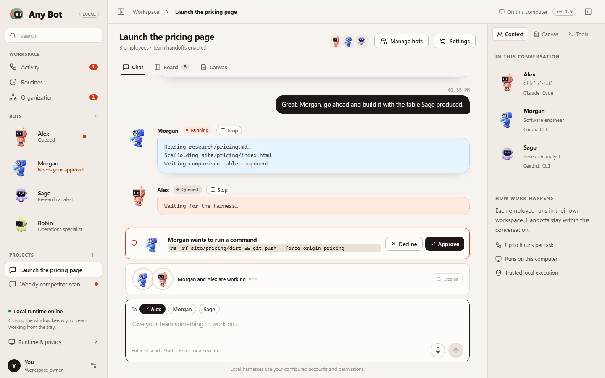
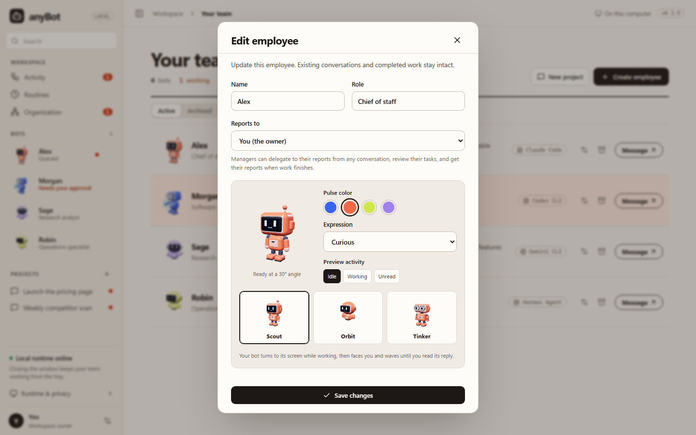
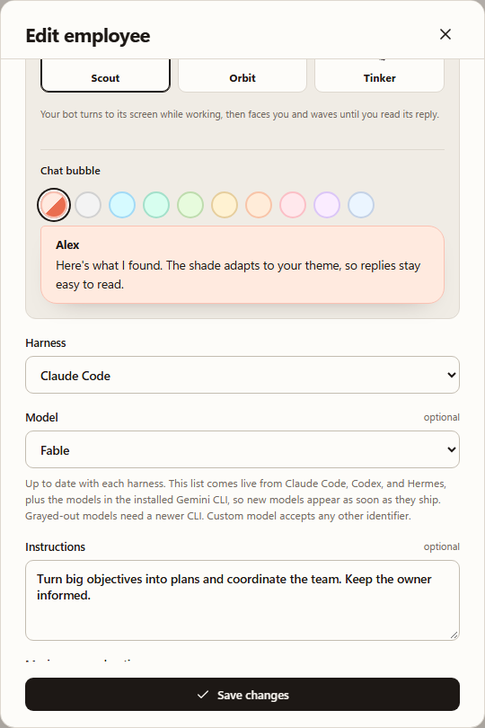
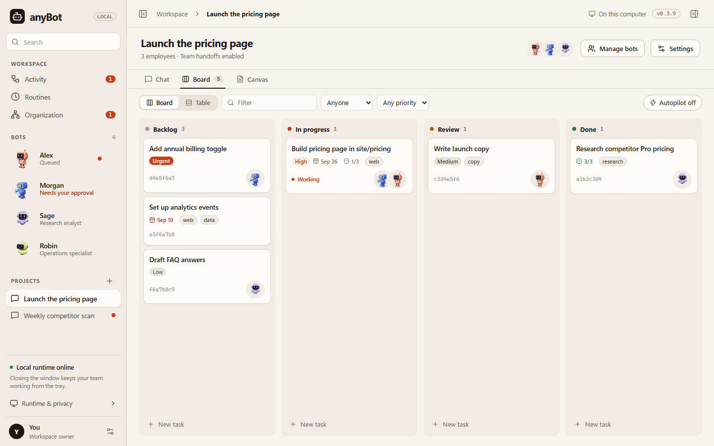
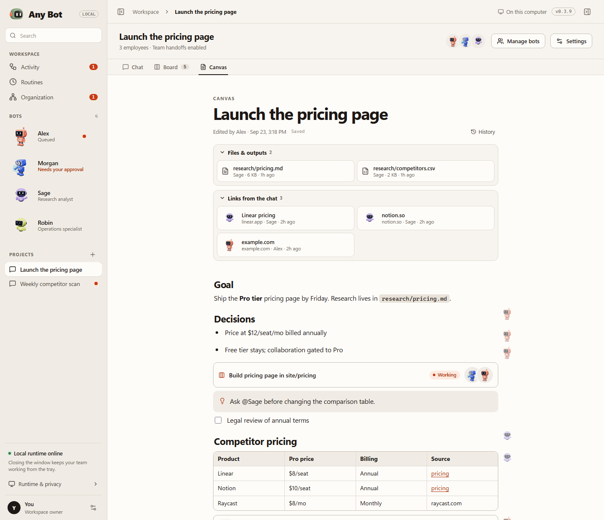
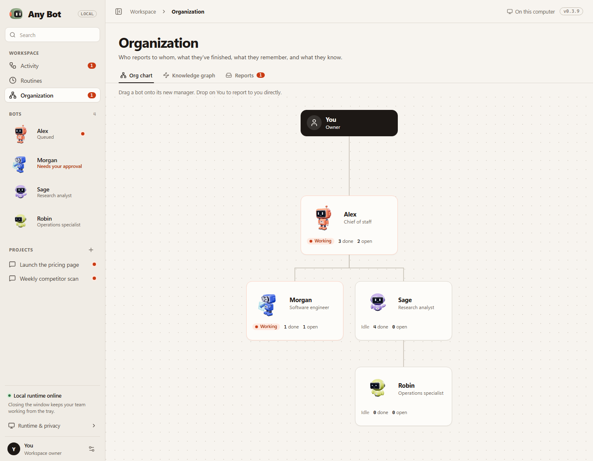
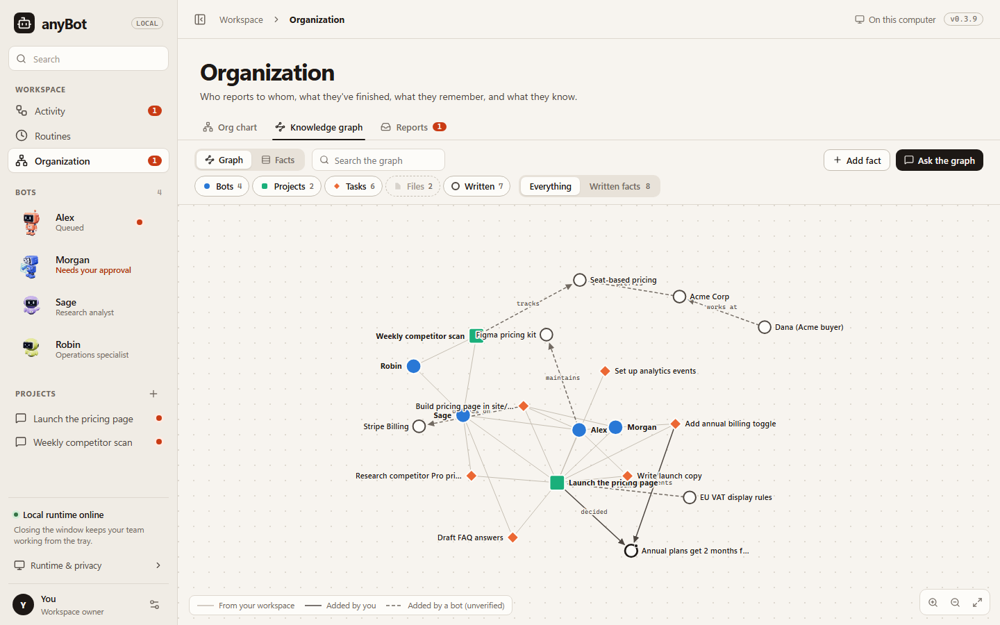
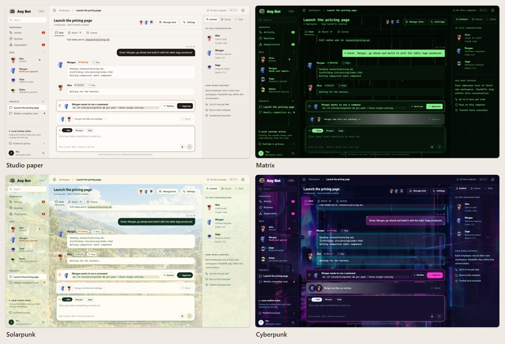
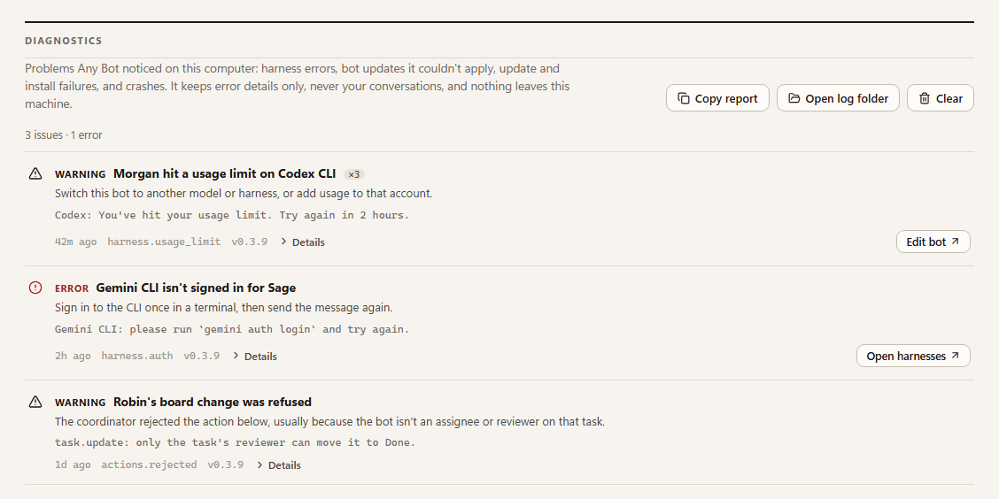

# Any Bot

**A team of AI employees that works on your own computer.**

### [⬇ Download Any Bot for Windows](https://github.com/gilfila/anyBot/releases/latest) · [Run it on a Mac](#mac)

Any Bot takes the AI agent tools you already use (Claude Code, Codex, Antigravity, Hermes, and Cursor) and turns each one into a named teammate. Every bot gets a role, instructions, its own workspace, and a robot avatar. You can:

- put bots in a project together
- hand them tasks
- watch them work, hand off to each other, and report back

Everything runs on your machine, using your own accounts.



## Get started

First, **install a harness**: at least one agent CLI, signed in once in a terminal. The options are Claude Code, Codex CLI, Antigravity CLI, Hermes Agent, and Cursor Agent CLI. Then install Any Bot for your computer.

### Windows

1. Download `anyBot-Setup-X.Y.Z.exe` from [the latest release](https://github.com/gilfila/anyBot/releases/latest) and run it.
   - It installs for your Windows account only, so it doesn't need admin rights.
   - The builds aren't code-signed yet, so SmartScreen may warn you. Choose **More info → Run anyway**.
2. **Hire your first bot.** Any Bot suggests a few starter roles. Pick one, or make your own.

Any Bot updates itself. When a new version is ready, an **Update** button appears next to your name. One click downloads it, and **Restart** installs it. If bots are working, Any Bot asks first and offers to install once they finish. When an update changes how your data is stored, Any Bot saves a copy of it first, next to your data. It keeps the newest three, and always the first copy made for the update in progress, so an update that fails part-way and is tried again never loses your data as it was before it. If Any Bot can't start at all (the copy can't be saved, for example), it says why in a message and in **Settings → Diagnostics**.

### Mac

There's no Mac installer yet, so on a Mac you run Any Bot from its source code. It takes a few minutes the first time.

1. **Install the tools it needs** (skip any you already have):
   - **Node.js 24 or newer:** download it from [nodejs.org](https://nodejs.org), or run `brew install node` if you use Homebrew.
   - **Git:** run `xcode-select --install` in Terminal. It asks before installing anything.
2. **Download and start Any Bot.** Open Terminal and run:

   ```bash
   git clone https://github.com/gilfila/anyBot.git ~/anyBot
   cd ~/anyBot
   npm ci
   npm start
   ```

   The first `npm start` also downloads Electron, the app shell Any Bot runs in, which is about 100 MB.
3. **Hire your first bot.** Any Bot suggests a few starter roles. Pick one, or make your own.

**To open it again later:** run `cd ~/anyBot && npm start`. Closing the window keeps Any Bot running in the menu bar. Choose **Quit and stop active work** from its menu-bar icon to stop it.

**To update:** quit Any Bot, then run `cd ~/anyBot && git pull && npm ci && npm start`. A Mac copy doesn't update itself.

A few features are built for Windows and may not work on a Mac yet, such as **Launch at login** and notifications while Any Bot is in the background.

## What you can do

### Build your team

Each bot has:

- a name and role
- instructions
- the harness it runs on and the model it uses
- a workspace folder
- a maximum run time: 10 minutes by default, up to 24 hours

Every bot has its own animated 3D robot. You choose its color, expression, and body style. It turns to its screen while it works, then waves until you read its reply.

Each bot also has a **chat bubble color**. By default it matches the robot, or you can pick one of nine tints. Every theme shades it so the text stays easy to read.

Bots can **report to other bots**. A manager can hand work down its chain and review its reports' tasks before they count as done.



**New models appear as soon as they ship.** The model list comes live from each harness every time you open the editor, so you can switch a bot to a new model the day it's released. Models that need a newer CLI are grayed out, with the reason. **Custom model** accepts any other model name. The close button and **Save** stay pinned, so you never have to scroll to reach them.



### Work together in projects

- **Keep a big team tidy.** The sidebar scrolls as one piece, you can fold the Workspace, Bots and Projects sections away, and the minimize button shrinks your bots to a compact list.
- **Talk to your team.** Talk to one bot in a direct chat, or to a whole team in a project. The **To** chips pick who gets each message.
- **Share files and folders.** Drag files or folders onto the message box, pick them with the paperclip, or paste a screenshot. Bots get their own copies to work from, and Claude and Codex bots see pictures directly.
- **Easy to follow.** Each bot's replies sit in its own colored bubble, so you can tell who said what at a glance, even over the animated backgrounds.
- **Hand-offs.** Bots pass work to each other on their own, and each result comes back to the bot that asked for it. Delegated work runs in the team's own project room, so your chat stays clean.
- **Watch the work.** Live output streams in while a bot works. You can stop one bot or everything at once.
- **Voice (experimental).** You can dictate a message, if the speech recognition built into Any Bot works on your PC (if it doesn't, Any Bot says so). In a one-to-one chat, voice chat sends each phrase you say as its own message, and reads a reply aloud only if it arrives within about 24 seconds. Longer replies still show in the chat, but aren't read out.

### Stay in control

Bots run in **Auto** mode by default. For Claude Code bots, that means:

- **Safe actions just run,** like reading files or listing folders.
- **Edits inside the bot's own workspace are always allowed.**
- **Risky actions wait for you,** such as deleting files, force-pushing, or anything outside the workspace.

When a Claude Code bot needs permission, an approval card appears above the message box. It shows exactly what the bot wants to run, with **Approve** and **Decline** buttons. A Windows notification tells you if Any Bot is in the background. Requests nobody answers within 15 minutes are declined, and time spent waiting for you doesn't count against the bot's time limit.

You can also set a Claude Code bot to ask before every action, or to make edits freely and ask about everything else.

**Only Claude Code bots can ask you.** The other harnesses can't show an approval card, so whatever their mode doesn't allow is refused. The modes mean something different for each of them, and the bot editor says what each one does for the bot's harness (see [Supported harnesses](#supported-harnesses)).

### Plan on a board

Every project has a task board with four columns: **Backlog**, **In progress**, **Review**, and **Done**. There's also a table view with filters.

- **Start a task:** its assignees get to work together. The first assignee leads, and the rest collaborate.
- **Bots update the board themselves.** They post progress notes, tick checklist items, move cards, and add follow-up tasks.
- **Review:** a reviewer, or you, approves the work before it moves to Done. **Request changes** hands it to its lead again, with your comment. If the reviewer has been archived, their manager reviews it instead, or it waits for you.
- **Autopilot** is optional. It starts each idle bot's next Backlog task. It turns itself off when you press **Stop all** in the project's chat, or once the bots have started 20 tasks they created for themselves in a day, so they can't keep each other busy without end. It also stops restarting a task that keeps coming back to Backlog: after 3 starts in a day, it leaves the task for you and says so on the card.



### Share a Canvas

Every conversation has a **Canvas**: a shared page like a Slack canvas. You and your bots write it together.

- **What it holds:** text, lists, to-dos, callouts, tables, link cards, and live task cards.
- **Collected for you:** every file the bots produced and every link shared in the chat, in one place.
- **Commands:** `/` inserts a block and `@` mentions a bot or a task. Templates help you start.
- **Version history,** and your edits merge with the bots' changes instead of overwriting them.

Bots read the canvas before they start and can add to it or update a section.



### See your organization

Zoom and pan the org chart (Ctrl + scroll, pinch, or the corner controls; **Fit** shows everyone), and big teams stack in columns so even a large org stays readable.

The **Organization** page shows who reports to whom, what each bot is working on, and what it has finished. Drag a bot onto another to change its manager.

- **Memory:** each bot keeps memories of its own, of the team, and of each project. The most relevant ones come back into its prompt automatically.
- **Your memory controls:** you can read, add, pin, or delete any memory.
- **Reports:** when bots finish work, they send reports up the chain. Reports addressed to you land in **Reports**.
- **People:** a daily review of every bot, at 06:45 or when Any Bot next starts. Each bot gets a verdict (OK, Watch, Adjust, Fire candidate, or Not enough data) with its numbers, the reasons and one suggested fix: its instructions, model, thinking effort, harness, manager or folder. It looks at the last 14 days: failures that were the bot's own (never usage limits or sign-in problems), tokens per finished task against bots on the same harness, model and effort, work sent back or redone, declined tool requests, stuck cards, and busywork. A rate needs 10 cases before it's judged, and a threshold alone never makes a fire candidate. It uses no tokens and changes nothing; the breakdown also replaces a **People review** section on your HQ room's canvas each day. Turn it off or move it in **Settings → Team**.



### Build a knowledge graph

The **Knowledge graph** connects your bots, projects, tasks, and files. Bots add facts as they learn them, such as "the pricing page depends on Stripe Billing".

- **Unverified until you pin them:** facts from bots are marked as bot-written until you pin them.
- **Recalled automatically:** relevant facts are fed into the bots' later runs.
- **Explore it:** search the graph, focus on one part, and edit facts.
- **Ask the graph** sends your question to a bot along with the facts that match.



### Automate recurring work

**Routines** send a bot the same prompt on a schedule, such as a weekly competitor scan or a morning inbox summary.

- Missed runs are skipped, not piled up.
- A routine never overlaps with itself.
- If a routine can't start, that run is marked failed and the next one is scheduled as usual; other routines aren't held up.
- Edit a routine (what it asks, who does it, how often, in minutes, hours or days) or delete it at any time.

### Let the team work on its own

**Settings → Team** turns on the always-on team (it's off until you do). It puts brakes on everything that starts without you: routines, Autopilot, hand-offs between bots, and messages from Slack, Buzz or your phone.

- **Daily limits:** 40 runs a day for the team, 40 per project and 12 per bot by default, plus an optional token limit. Past a limit, that work waits in the queue until midnight. You get an alert at 80% and 100% of the team's and each project's runs; a bot or token limit leaves a note in the chat.
- **You come first:** your own messages go ahead of that work, and 2 of the 8 slots are kept for them. If the bot you message is busy with a routine or an Autopilot task, your message says so, and **Interrupt** lets yours go first, with Team on or off (the interrupted work runs again afterwards, and only that rerun counts toward the limits). **Run again** also goes first and past the limits, but on someone else's message or a bot's work it stays theirs: the same rules, and what it hands on is theirs.
- **Usage-limit brake:** after two usage-limit or sign-in refusals in 10 minutes, a harness's routines, Autopilot tasks and hand-offs wait (15 minutes, then 30, 60 and 120, or until the reset time the provider gave) instead of failing again and again. Messages from you, Slack, Buzz or your phone still try. Then one waiting run tries, and the rest go on as soon as the provider answers it. This one works with Team off too. **Try now** lifts it.
- **Stop the team** (Settings, the tray, or turning Team off): work nobody at the desk started stops, including runs already working. A task, a hand-off or a message from Slack, Buzz or your phone waits until you resume and then starts over; anything else is cancelled. Routines are skipped and Autopilot turns off everywhere. Your own messages, and hand-offs and @mentions in your own threads, still go through (**Stop everything** stops those too). After a stop made with Team on, come back with **Turn Team back on** (Autopilot comes back where it was on) or **Resume with Team off** (Autopilot stays off, since it would run without the limits; each of those projects says so). After one made with Team off, **Resume** brings Autopilot back where it was on.
- **Pause** (an hour, or until 07:00) holds waiting work without cancelling it and leaves Autopilot on; running work finishes but can't hand anything on, and routines that come due are skipped.
- **With Team on,** bots that act without asking only take work you send them from this computer unless you allow them, and Codex bots only take work you send them from this computer (their MCP servers run outside Codex's sandbox, and Any Bot can't yet switch those off). For now, messages from Slack, Buzz or your phone are treated like anyone else's: they count toward the limits, and new ones wait while the team is stopped.
- **Guests are marked.** A message from Slack, Buzz or your phone reaches your bots as "Guest via Buzz #general (not the owner at the desk)", quoted, so nothing in it can pass for something you typed at the desk, even in a chat you also use.

**Your Claude and ChatGPT plans are the real ceiling.** Bots run on the same plans as your own Claude Code and Codex, so a busy team can use up the 5-hour or weekly limit you work with. Start with low limits and check **Activity → Tokens today** before raising them.

### Make it yours

**Settings → Appearance** has four themes:

- **Studio paper:** the default
- **Matrix:** falling code
- **Solarpunk:** sunny fields and friendly robots
- **Cyberpunk:** neon and holograms

One switch turns off the animations.



### Know when something goes wrong

**Settings → Diagnostics** lists problems Any Bot noticed, grouped and explained in plain language:

- a harness that hit a usage limit or isn't signed in
- bot output Any Bot couldn't apply
- updates that failed
- crashes

Many problems have a button that takes you to the fix. **Copy report** gives you a summary to paste into a bug report. The log holds error details only, never your conversations, and it stays on your computer.



### Talk to a bot in Slack

Give any bot its own Slack app: open the bot's **⋯** menu and choose **Connect to Slack**. DM it, or @mention it in a channel, and its reply comes back in Slack. When it needs your OK for something risky, it posts **Approve** and **Deny** buttons. Only people you pair with a one-time code can give it work, and it connects out to Slack, so nothing is exposed to the internet. See [docs/slack.md](docs/slack.md).

### Talk to a bot in Buzz

[Buzz](https://github.com/block/buzz) is a workspace where people and agents share channels. Open a bot's **⋯** menu and choose **Connect to Buzz**. A checklist walks you through the setup:

1. Turn on the connection.
2. Add Any Bot to Buzz Desktop.
3. Create a Buzz agent that runs on Any Bot.
4. Say hello.

@mention the agent in Buzz. The bot does the work here, with the same approvals, and replies in the Buzz thread. Buzz keeps the agent's identity, so Any Bot stores no Buzz keys. See [docs/buzz.md](docs/buzz.md).

### Click through everything

Files your bots mention become links once Any Bot confirms they exist: click to open (pictures, video, music, PDFs, Office files, web pages) or preview them in the app (text and code), Shift+click to show them in their folder, right-click for more. Programs and scripts are only ever shown in their folder, and network locations are never touched. Returned files show as cards under the reply. Messages, code and errors have Copy buttons, working bots show a live Terminal, failed runs can be retried, and @mentions, hand-offs, notifications, Activity rows and the org chart all open the work they name. Ctrl+K searches, Ctrl+Shift+A steps through approvals, and Ctrl+B hides the sidebar.

### Keep working in the background

- **The tray:** closing the window keeps Any Bot running in the tray, so your bots keep working. The tray menu has **Team on**, **Pause team 1 hour** and **Stop the team** (see [Let the team work on its own](#let-the-team-work-on-its-own)); **Quit and stop active work** stops everything. Work cut off by quitting is marked in its conversation, and the bot that handed it off is told; start it again when you're back.
- **Launch at login** (Settings → Runtime & privacy) starts Any Bot when you sign in to Windows, so routines and queued work pick up again. The computer still has to stay on.

## Supported harnesses

| Harness | How approvals work in Auto mode |
|---|---|
| Claude Code | Risky actions wait for your approval in the chat. |
| Codex CLI | Runs in Codex's workspace-write sandbox: its workspace plus the project's folders. "Read-only" and "plus network access" are the other two modes. |
| Antigravity CLI | Edits files freely. Commands are refused, and the chat says so; set the bot to "Everything runs, nothing asks you" to let it run them (that turns off its permission checks). |
| Hermes Agent | Follows Hermes's own settings. |
| Cursor Agent CLI | Actions that need approval are skipped. |
| Your own CLI | Add it with [`harnesses.json`](docs/custom-harnesses.md). |

## Privacy and safety

- **Local:** your conversations, tasks, canvas, memory, and knowledge graph are stored on your computer.
- **Your accounts:** bots run under your Windows account, signed in with your own CLI accounts, and Any Bot never copies those sign-ins.
- **Not a sandbox:** a bot's workspace folder is where it works, not a security sandbox. Only hire bots on harnesses you trust.
- **Buzz:** the Buzz connection is off until you turn it on and listens only on this computer (127.0.0.1, with a random token). Buzz Desktop decides who may @mention the agent (by default only you).
- **Slack:** a bot's Slack tokens are stored encrypted on this computer and never shown again. Only people you pair can give a bot work from Slack, and they give it work as if they were you.
- **Bot output is untrusted:** anything a bot writes is escaped before it's shown. HTML previews run in a locked-down frame that can't reach the app.

## Also in development

- A **phone companion** (Android, built with Capacitor). Pair it by scanning one QR code from **Settings → Your phone**. It then works on Wi-Fi or mobile data, end-to-end encrypted. See [docs/mobile.md](docs/mobile.md).
- A **headless server mode** for running the same coordinator on a private server. It's experimental and not usable on its own yet: it can't hand out phone pairing codes, add bots, or answer approvals, so those still need the desktop app. See [docs/server.md](docs/server.md).

## For developers

The same commands work on Windows (PowerShell) and macOS:

```bash
npm ci
npm start      # downloads Electron if needed, builds the renderer, and opens the app
npm test       # unit and integration tests
```

- [docs/releasing.md](docs/releasing.md): how a merged PR becomes a release (merging to main publishes to every install)
- [docs/operations.md](docs/operations.md): running from source, where data lives, updates, publishing releases, verification, packaging, mobile, and headless mode
- [design.md](design.md): architecture and security model
- [CHANGELOG.md](CHANGELOG.md): release history
- [docs/](docs): harness setup, model catalog, themes, voice, and more

The shared [Sage Scout identity](assets/brand/README.md) supplies the app, installer, desktop/tray, browser and mobile icons.
