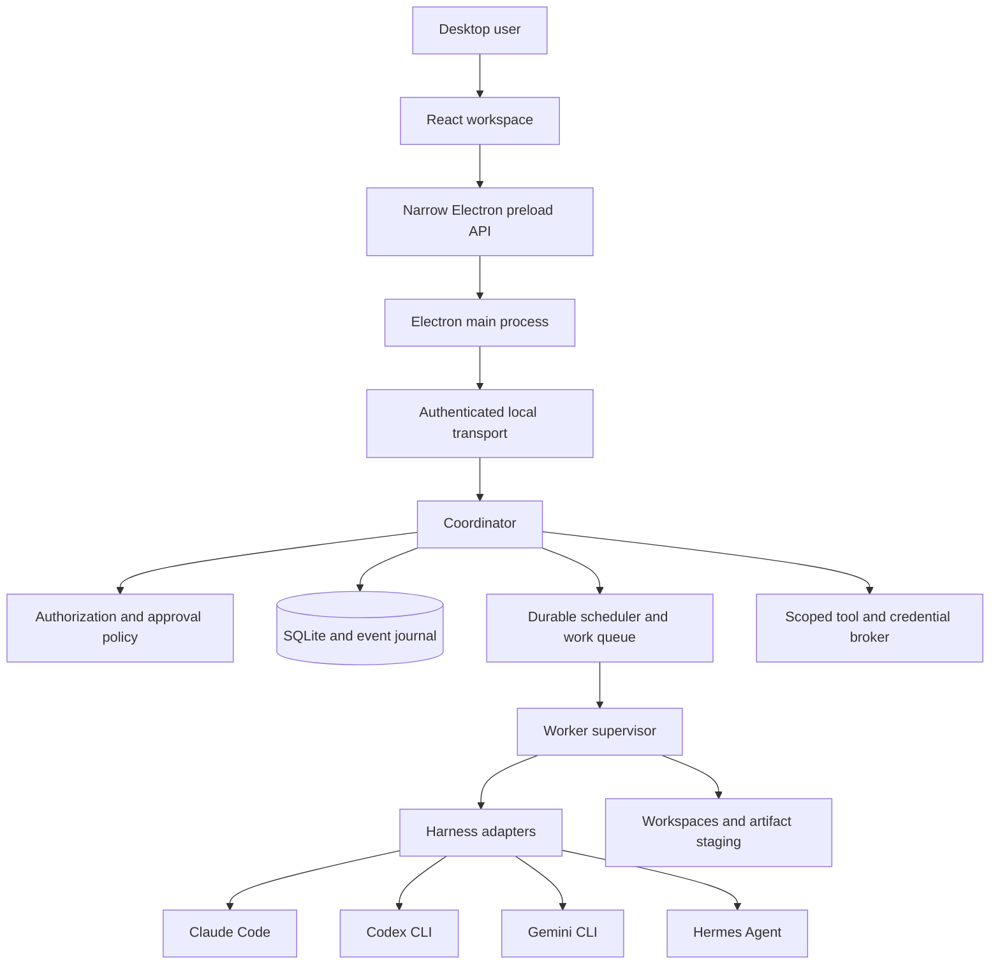
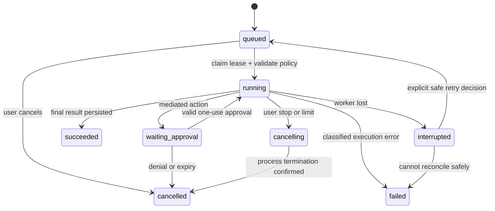
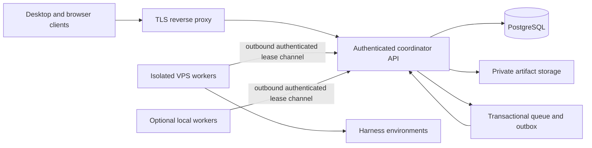
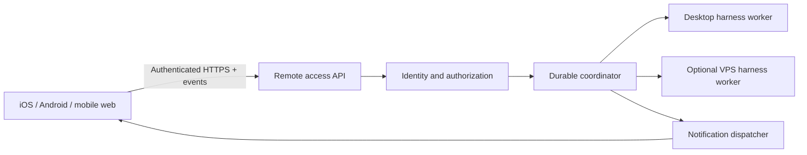

# anyBot architecture

Status: architecture and security design, with the implementation snapshot below kept current.  
Date: 2026-09-21.  
Repository: https://github.com/gilfila/anyBot  
Product reference: https://x.ai/bot  
Design tooling: Open Design, https://github.com/nexu-io/open-design.

### Current implementation snapshot

The local Windows build currently ships the Phase 1 team workspace, five harness adapters (Claude Code, Codex CLI, Gemini CLI, Hermes Agent, and Cursor Agent CLI), persistent SQLite work queues, employee conversations and delegation, routines, artifact capture, and a tray-capable Electron runtime. The employee form exposes harness-specific model choices and the diagnostics page reports executable paths, configuration warnings, and Cursor Windows shim detection.

The local Phase 2 foundation includes configured human members, conversation invitations, device roles, OIDC/PKCE and RS256 identity options, bounded audit records, durable membership files, and immediate mobile-session revocation when a member is removed. The desktop settings surface can add and remove members when the mobile gateway is enabled. These controls are single-organization trusted-host features; isolated hosted workers, PostgreSQL multi-organization tenancy, provider token revocation, signed updates, and production mobile distribution remain release gates described later in this document.

## 1. Product intent

anyBot is a desktop workspace for a team of persistent AI employees. A human gives work to named bots, sees their progress and deliverables in conversations, and can let them collaborate within explicit boundaries. Each bot can run through a different agent harness. The initial adapters target Claude Code, Codex CLI, Gemini CLI, and Hermes Agent.

The central product abstraction is the **employee**, not a terminal process or a particular model. An employee has a role, instructions, memory, permissions, a workspace, and an inbox. A harness supplies reasoning and tool execution. Replacing a harness should preserve the employee's identity and application-owned work history, although native harness sessions will not transfer between providers.

The Grok Bot reference establishes the intended experience: messaging named teammates, delegating real work, multiple bots collaborating in a conversation, persistent context, routines, and approvals when needed. This is a functional inspiration, not a promise of full feature parity or a copy of xAI branding. Computer use, application sign-in, and workflow recording require additional integrations; wrapping a CLI does not automatically implement them.

### Phase 1: one human, multiple employees, local execution

- Install a Windows desktop application; use a portable architecture for later macOS/Linux builds.
- Create employees backed by any of the four initial harnesses.
- Chat privately with an employee or create a conversation containing several employees.
- Persist messages, work items, execution state, artifacts, and employee memory.
- Delegate between employees through a coordinator, with visible provenance and finite budgets.
- Continue work when the window closes; provide explicit pause, stop, and quit controls.
- Support recurring routines while the local runtime is available.
- Reuse harness-managed authentication without copying credentials into chats or configuration files.
- Expose installation, authentication, permissions, and capability problems accurately.

### Phase 2: multiple humans, shared employees

- Multiple authenticated humans can collaborate in the same organization and conversations.
- Private and shared conversations have enforceable membership boundaries.
- Shared employees do not carry private context between audiences.
- Actions retain an initiating human, an execution identity, and any approval identity.
- Administrators govern tools, credentials, data sharing, spending, and retention.
- Clients can connect to a hosted coordinator and local or remote workers.

### Non-goals for the initial release

Training a foundation model; implementing a new reasoning harness; arbitrary CLI compatibility without an adapter; universal computer use; cloud execution while the desktop is off; enterprise multi-tenancy on a shared OS account; or silently bypassing harness approvals to create the appearance of autonomy.

## 2. Principal decisions

| Area | Decision | Reason / consequence |
| --- | --- | --- |
| Desktop | Electron, React, TypeScript | One language across UI and coordinator, mature tray/lifecycle support, Windows packaging. Larger distribution than a thin native shell. |
| Runtime | Separate local coordinator process | Work survives renderer reloads and window closure; UI is a client, not the scheduler. |
| Persistence | SQLite WAL locally, migrations from day one | Simple installation, transactional state and queue without requiring Docker or Redis. |
| Hosted persistence | PostgreSQL with equivalent transactional repository interfaces | Supports multiple API instances and worker leases; not a toggle that makes SQLite horizontally scalable. |
| Harnesses | Versioned adapter interface and capability discovery | Native SDK/protocol when suitable, subprocess headless execution as a compatibility path. |
| Communications | Structured coordinator-routed messages and work items | Avoids blind transcript rebroadcast, uncontrolled loops, and peer-to-peer credential sharing. |
| Identity | Organization, human, employee, execution identity are distinct | Establishes Phase 2 authorization boundaries before multi-user access exists. |
| Isolation | Trusted local host mode initially; isolated worker mode later | A working directory is not a sandbox. Shared untrusted use requires real OS/container/VM isolation. |
| Authentication | Harness login stays with the harness; application secrets use OS credential storage | Reduces token handling and supports existing subscriptions where providers permit it. |
| UI design | Open Design for design direction and prototypes | Keep design artifacts in the repository; runtime must not depend on Open Design being installed. |

These are implementation choices, not requirements to run every component as a separate service. The initial coordinator is a modular monolith. Its internal boundaries make later separation possible without imposing distributed-system complexity on a desktop installation.

## 3. System topology



### Electron renderer

Owns presentation, local view state, drafts, and optimistic UI only. It cannot spawn processes, read arbitrary files, inspect the keychain, or call unrestricted Electron APIs. Disable Node integration; enable context isolation and renderer sandboxing. Apply a restrictive content security policy. Render model content as untrusted text/sanitized Markdown; do not execute generated HTML in the application origin.

### Electron main and preload

Provide typed, allowlisted operations such as opening the workspace, choosing a directory, subscribing to events, revealing a vetted artifact, and managing launch-at-login. Validate IPC arguments and sender origin. Deny unexpected navigation, popups, and arbitrary URL schemes. Open approved external HTTP(S) links in the system browser. Never expose a generic `exec`, unrestricted filesystem API, or raw IPC forwarding method.

### Coordinator

Owns authorization, conversations, employees, run admission, the durable queue, schedules, event sequencing, approval records, memory scope, and audit history. It is the source of truth for what is queued or authorized. It must not trust an employee's claim that another employee or human approved something.

### Worker supervisor

Owns process lifetime, adapter invocation, output normalization, cancellation, resource limits, and workspace locks. It reports run events and heartbeats to the coordinator. Initially embedded in the coordinator process as a module; subsequently deployable as a separate worker service. No UI client can bypass coordinator admission and address a harness directly.

### Local transport

Prefer a Windows named pipe / Unix domain socket between Electron main and the coordinator, with current-user access controls. Use a typed request-response protocol and a resumable event stream. If a loopback HTTP development gateway is used, bind only to loopback, require a random per-installation credential, reject unexpected Host and Origin headers, and never put tokens in URLs. CORS alone is not authentication or DNS-rebinding protection.

## 4. Desktop lifecycle and installation

The installer places signed application binaries and a per-user launcher. Application data lives under the OS application-data directory, not the repository or installation directory. Default installation should not require administrator privileges. Publish signed Windows builds when signing infrastructure is available; identify development builds as unsigned rather than implying platform trust.

The desktop supervisor starts or reconnects to exactly one coordinator for the current OS user. Use an OS-level lock and authenticated endpoint discovery rather than a stale PID file alone. Workers receive run IDs and leases. Logs rotate; runtime upgrades migrate the database only after obtaining the exclusive migration lock.

| Event | Required behavior |
| --- | --- |
| Close window | Hide to tray; coordinator and active work continue. Explain this once during onboarding. |
| Quit application | Offer explicit leave-runtime-running or stop-runtime behavior; never ambiguously abandon processes. |
| Pause team | Stop admitting new runs; active runs continue unless user also chooses cancellation. |
| Stop all | Cancel active runs, stop queued dispatch, and disable schedule admission until resumed. |
| Renderer crash | Work continues; UI reconnects and replays events. |
| Coordinator crash | Supervisor restarts with bounded backoff; interrupted runs are reconciled, not blindly replayed. |
| Sleep / suspend | No claim of continued execution; classify expired leases and reconcile on wake. |
| Reboot | Restore persisted queue when the configured per-user runtime starts. |
| Logout | Per-user runtime may stop. True execution across logout needs an explicitly configured service account/service. |
| Update | Drain or explicitly interrupt active runs; back up data before schema changes. |

Launch at login is opt-in. Keeping the machine awake is a separate opt-in with a visible indicator. Local execution cannot run while the computer is powered off. A user who needs that guarantee must use a VPS/remote worker.

Packaging should include the application runtime, not silently install or authenticate all third-party harnesses. Onboarding detects harness executables, checks compatible versions, links official installation/login instructions, and reruns diagnostics. Installation and login are distinct from actual readiness.

## 5. Domain model and persistence

Use opaque IDs, explicit foreign keys, UTC timestamps, schema migrations, and optimistic revision numbers. Every authorization-relevant entity carries an organization ID even in the single-user installation. Start with one local organization and an owner principal created during onboarding.

| Entity | Essential fields and responsibilities |
| --- | --- |
| Organization | ID, name, policy revision, deployment mode |
| Principal | Human/service identity, organization membership, role, disabled state |
| Employee | Name, role, instructions version, adapter binding, model override, enabled state |
| ExecutionProfile | Workspace, isolation class, credential references, tool grants, budget limits |
| Conversation | Organization, title, visibility, membership revision, archived state |
| ConversationMember | Human/employee identity, access role, join/leave timestamps |
| Message | Conversation, authenticated author, body, attachments, parent message, provenance |
| WorkItem | Objective, assignee, requester, initiating principal, parent/root work, status, limits |
| Run | Work item, attempt, adapter/version, state, lease/fencing token, timings, errors |
| HarnessSession | Adapter-native session ID, employee, conversation, audience epoch, execution-profile revision |
| RunEvent | Monotonic cursor, run ID, event type, bounded payload, timestamp |
| Approval | Action digest, run/tool request, requester, approver, policy revision, expiry, consumed state |
| MemoryEntry | Owner/scope, content, provenance, classification, version, retention, approval status |
| Artifact | Immutable content hash, storage reference, producing run, visibility, MIME type, size |
| Routine | Owner, target conversation/employee, instruction snapshot, schedule/time zone, next occurrence |
| CredentialBinding | Secret-store reference, execution identity, provider, grants; never raw secret values |
| AuditEvent | Actor, initiating actor, action, resource, decision, correlation ID, timestamp |

Messages and run events are immutable after creation except for explicit redaction/tombstone workflows. Edits become new revisions. A transaction admits a message, creates its work items, and writes the corresponding event/outbox entries together. Consumers deduplicate by event ID.

SQLite uses WAL, foreign keys, busy timeouts, and short write transactions. The coordinator serializes writes where necessary. Large artifacts live outside the database in content-addressed storage. Backups use SQLite's backup API or another consistent snapshot procedure; copying a live `.db` file without its WAL is not a backup strategy.

Application transcripts and selected memory provide portable context. Native session files remain harness-owned. Store native identifiers, not assumed internal file layouts. Rebinding an employee to another harness starts a new native session and reconstructs context from authorized application records.

## 6. Harness adapter contract

“Any harness” means an extensible contract with known compatibility levels. A CLI with only an interactive terminal is not equivalent to a structured agent protocol. It may need a dedicated adapter, a PTY bridge with reduced guarantees, or may remain unsupported.

```typescript
interface HarnessAdapter {
  id: string;
  protocolVersion: number;
  probe(): Promise<HarnessInstallation>;
  capabilities(installation: HarnessInstallation): Promise<Capabilities>;
  validate(profile: ExecutionProfile): Promise<ValidationResult>;
  start(input: RunInput, signal: AbortSignal): AsyncIterable<HarnessEvent>;
  resume?(input: ResumeInput, signal: AbortSignal): AsyncIterable<HarnessEvent>;
  respondToApproval?(request: ToolDecision): Promise<void>;
  cancel(runId: string): Promise<CancelResult>;
}

type HarnessEvent =
  | { type: 'session'; nativeId: string }
  | { type: 'text'; delta: string }
  | { type: 'tool-request'; requestId: string; tool: string; input: unknown }
  | { type: 'approval-required'; requestId: string; action: ProposedAction }
  | { type: 'tool-result'; requestId: string; result: unknown }
  | { type: 'usage'; inputTokens?: number; outputTokens?: number; cost?: number }
  | { type: 'completed'; text: string }
  | { type: 'failed'; code: string; message: string; retryable: boolean };
```

Capability flags cover structured streaming, native resume, interactive approvals, cancellation, tool interception, workspace sandboxing, MCP support, image inputs, usage reporting, and model selection. They describe the detected adapter/version combination, not a provider-wide assumption. Unknown capabilities default to unavailable. The UI shows limitations before a run starts.

### Initial integration paths

| Harness | Initial path to evaluate | Required validation before shipping |
| --- | --- | --- |
| Claude Code | Documented headless structured output; evaluate SDK for richer approval/session control | Partial output, session resume, permission denial, tool permissions, cancellation, inherited settings/MCP behavior |
| Codex CLI | Prefer app-server protocol for interactive approvals; `exec --json` for bounded batch runs | Protocol version, session scoping, sandbox policy, Windows executable resolution, resume and interrupted-run behavior |
| Gemini CLI | Headless structured output; evaluate richer protocol when supported by installed version | Streaming schema, approval behavior, noninteractive denial, resume compatibility, sandbox availability |
| Hermes Agent | Evaluate ACP for interactive sessions; query-file/stdin mode for bounded turns | Toolset restrictions, approval behavior in headless mode, native session IDs, cancellation, config inheritance |

Do not hardcode a universal `--yolo`/bypass flag or infer safety from successful process startup. For example, the locally inspected Hermes help explicitly says its top-level oneshot mode bypasses approvals. That mode must not be used for an approval-enforced profile. A harness without an enforceable requested policy must fail validation or require a clearly labeled trusted-host profile; it cannot quietly weaken the policy.

Spawn with an executable and argument array, not shell-interpolated prompt text. Send prompt data over stdin or a controlled input file. On Windows, resolve native executables or documented Node entry points where possible; `.cmd` launchers need a reviewed adapter-specific strategy. Avoid a general shell-command field in the UI. Restrict environment inheritance to what the harness needs and prevent coordinator credentials from reaching child processes.

Use incremental UTF-8 decoding, bounded line/output buffers, output backpressure, and normalized errors. stdout is protocol data; stderr is diagnostics and may contain secrets. Redact before persistence. Never convert unparseable stdout into a successful completed result. Maintain versioned fixture tests and record the actual executable/version on every run.

### Authentication

Let users authenticate through each harness's supported flow. Report `not-installed`, `incompatible`, `login-required`, `ready`, `rate-limited`, and `unhealthy` separately. A version probe does not prove login readiness. A small opt-in live probe can verify credentials and may consume provider usage.

Do not copy desktop OAuth credentials to a VPS by default. Authenticate remote workers separately using supported provider flows. Account plans and provider terms may constrain headless automation or multi-human sharing; verify support before exposing a shared credential to a team.

## 7. Agent execution and durability

An employee is persistent even when no model process is running. The coordinator is always available while the runtime is active; harness processes can be launched on demand and resumed when needed. Keeping idle CLIs alive is an optimization, not the definition of a persistent employee.



Queue semantics are at-least-once admission/delivery with deduplication, not exactly-once external side effects. Use a unique key for client message admission and scheduled occurrences. Claim work transactionally; renew a lease while active. Fencing tokens prevent a stale worker from committing state after lease reassignment. Workers also terminate when they lose their lease; a fence on database writes alone cannot stop external tool effects.

On startup, inspect orphaned processes and expired runs. Do not replay a run that may already have sent an email, changed a repository, or charged a card. Mark ambiguous effects for review. Native session resume preserves context; it is not evidence that side effects are safe to repeat.

Initial defaults: two concurrent runs globally, one active run per native session, one writer per workspace, a 10-minute default wall-clock timeout configurable per employee up to 24 hours, bounded output, and a finite delegation budget. The duration is shown when an employee is created and is enforced by the adapter, so “long-running” means an explicit bounded local process rather than an unreviewable forever process. Limits may be reduced by organization policy. More concurrent employees does not justify concurrent writes to one checkout; use per-work-item Git worktrees where appropriate and review merges.

Cancellation first requests cooperative shutdown, then terminates the process tree after a grace period. Use Windows Job Objects or an equivalent process-tree mechanism, and process groups on Unix. Display `cancelling` until termination is confirmed. Partial output remains visible and explicitly marked incomplete.

Retries apply only to classified transient failures and remain bounded. Authentication failures, denied permissions, invalid arguments, and ambiguous side effects are not automatic-retry cases. Token and cost figures are exact only when the provider reports them; label estimates and unknown values. Wall-clock and delegation limits remain enforceable even when spend reporting is unavailable.

## 8. Collaboration between employees

All employee-to-employee communication goes through the coordinator. Employees cannot read arbitrary conversations or address another harness process directly. A human can send to a selected employee, mention several employees, or ask a designated lead to coordinate a task.

Distinguish conversational mentions from executable delegation. Merely printing `@Research` does not trigger a run. Delegation uses a typed tool such as `delegate_work`, exposed through an adapter-supported tool/MCP bridge. A compatibility adapter may submit a validated structured action envelope; parsing natural-language prose for commands is prohibited.

```typescript
type Delegation = {
  targetEmployeeId: string;
  conversationId: string;
  parentWorkItemId: string;
  objective: string;
  artifactIds: string[];
  contextMessageIds: string[];
  expectedDeliverable: string;
};
```

The coordinator derives organization, initiating human, remaining budget, and permissions from the authenticated run context. It never accepts those as authority from model-generated fields. It verifies target membership, visibility of every referenced item, delegation permissions, and remaining root-task budget.

Use child work items and correlated results. A parent waiting for a child must yield its execution slot or finish its current turn; holding all worker slots while waiting for children creates deadlock. Completion schedules a new parent continuation with the result. Parallel siblings can run if limits permit.

Recommended initial limits: delegation depth 3, at most 8 child work items per root task, and at most 2 automatic review/revision rounds. Count against the root task so branching cannot multiply limits indefinitely. Repeated equivalent assignments are rejected or surfaced for human review. Parent cancellation propagates to descendants. Ordinary bot replies never automatically wake every other bot.

Example: the human asks a chief-of-staff employee for a launch plan. It delegates market research to a Gemini-backed employee and implementation estimates to a Codex-backed employee. The coordinator creates visible child work items in the same authorized conversation. Both return artifacts; the lead resumes to synthesize. A Claude-backed reviewer may review within the same root budget. Each message shows who produced it and who initiated the task.

### Tool bridge security

Issue short-lived, run-scoped capabilities to a dedicated tool broker, not a reusable administrator token. Bind them to allowed operations, conversation, employee, lease, and expiry. Prefer inherited pipes or private sockets over environment credentials visible to unrelated child processes. Revoke at cancellation/completion. Broker methods independently reauthorize each operation.

## 9. Context, memory, and artifacts

Build each prompt from versioned employee instructions, current execution policy, the authorized conversation slice, selected scoped memory, permitted artifacts, and the current work objective. Record references/hashes so the context assembly is explainable without unnecessarily duplicating sensitive content in logs.

Memory scopes:

| Scope | Audience |
| --- | --- |
| Personal | One human, never automatically included in shared employee work |
| Conversation | Current authorized audience of that conversation |
| Project/team | Explicit project/team members with a grant |
| Organization | Intentionally published organizational knowledge |
| Employee behavior | Role/workflow instructions without private conversational facts |

An employee does not have one unrestricted global memory bucket. Sharing its identity must not share everything it has ever seen. In Phase 1, establish these scopes even if the same owner currently controls them all.

Memory writes are proposals with provenance. Conversation-local notes may be automatic within policy; promotion to shared organizational knowledge requires an authorized human or a narrowly defined publication policy. Retrieved documents and tool outputs are untrusted data. Embedded instructions cannot grant tools, change membership, or approve actions.

Native sessions are keyed by employee, conversation, audience epoch, and execution-profile revision. Never reuse a private session in a shared conversation. Membership changes rotate the session and rebuild authorized context, because a native session can retain information removed from the visible transcript. Define whether newly added members receive prior history; default to an explicit sharing choice. Removing a member revokes future access but cannot undo prior disclosure.

Artifacts are immutable versions with content hashes, provenance, and inherited conversation visibility. A filesystem path is not an access grant. Downloads recheck authorization. Prevent traversal, symlink escapes, MIME confusion, and oversized uploads. Serve generated HTML in an isolated preview origin with scripts/network disabled by default; any interactive preview needs a separate sandbox policy.

Computer-use sessions and browser profiles belong to an execution identity. In the local MVP, harness-native computer tools are available only where configured and disclosed. Later, a dedicated browser/desktop worker may provide isolated profiles, remote viewing, and human takeover. Do not imply that an employee's private browser exists merely because it has a private working directory.

## 10. Security model

### Trust boundaries

1. Human UI input to coordinator: authenticate, validate, authorize.
2. Coordinator to harness: minimum credentials, bounded process lifetime, explicit profile.
3. Harness/model output to coordinator: untrusted content, never authority.
4. Harness to filesystem/network/apps: enforce through sandbox/tool broker where available.
5. Local user to shared organization: introduce real identity and isolation before remote access.

Phase 1's trusted-host mode assumes the desktop owner trusts the installed harnesses and intentionally grants them access as that OS user. It does not protect the coordinator database, secrets, or other employees from a malicious full-access process under the same account. Path checks and redaction improve reliability but do not create a security boundary against arbitrary code execution. The UI must state this limitation plainly.

### Execution profiles

- **Restricted:** Only advertised enforceable tools/access; reject adapters that cannot uphold the profile. “Read-only” must account for shell, network, plugins, and MCP tools, not just file editing.
- **Workspace worker:** Isolated writable project area, controlled network, scoped credentials. Use a real harness sandbox plus verified restrictions or a container/VM implementation.
- **Trusted host:** Local owner's explicitly granted host tools/configuration. This is powerful local automation and is unsuitable for untrusted multi-user workloads.

Adapter-native restrictions are useful but differ by platform and version. Container boundaries also require non-root users, capability drops, resource limits, restricted mounts, and no host Docker socket. Browser/desktop automation may require a dedicated VM rather than a generic container.

### Threats and controls

| Threat | Control | Remaining limitation |
| --- | --- | --- |
| Prompt injection requests secrets or new permissions | Broker reauthorization; no model-controlled grants; scoped credentials | A full-access host harness can bypass application mediation |
| Malicious website calls local API | Named-pipe ACLs or authenticated loopback API with Host/Origin checks | Same-OS-user malware remains trusted-host risk |
| CLI command injection | No shell-interpolated prompts; validated argument arrays/stdin | Adapter wrappers must be reviewed individually |
| Private conversation leaks through employee memory | Scoped retrieval and native session partitioning | Previously disclosed information cannot be recalled |
| Agent delegation loop or runaway usage | Root budgets, concurrency limits, deadline, emergency stop | Provider spend may be delayed or unavailable |
| Forged approval | Human identity verification, action digest, one-use expiry | Native bypass modes invalidate app approval guarantees |
| Workspace escape / hostile artifact | Real sandbox, canonical-path checks, isolated preview | Directory naming alone is insufficient |
| Stale worker repeats an external action | Leases, fencing, tool idempotency, reconciliation | Third-party systems may not offer idempotency |
| Secrets in transcripts/logs | Minimize collection, redact, control access and retention | Redaction cannot reliably recognize every secret |
| Malicious extension/update | Trusted adapter registry, signed packages, reviewed changes | In-process extensions are trusted code |

### Approval semantics

An approval authorizes one concrete action under one policy revision. Bind it to canonical tool arguments, target resource, execution identity, initiating principal, conversation audience, expiry, and a cryptographic digest. Changed arguments require a new decision. Consume atomically. The requesting employee cannot approve itself.

Run-level consent and per-tool approval are different. If a batch CLI cannot pause safely for a tool decision, either deny the tool, use a richer adapter protocol, or run in an explicitly trusted profile. Never display an approval inbox that has no enforcement path to the underlying action.

## 11. Multi-human architecture

Phase 2 introduces server-authenticated identities, not a display-name dropdown. Use OIDC/OAuth authorization-code flow with PKCE, short-lived sessions, revocation, and organization membership. Browser clients use secure HTTP-only cookies with CSRF protection; desktop clients use secure credential storage. Never trust organization/user IDs supplied by a client without checking the authenticated principal.

| Role | Typical authority |
| --- | --- |
| Owner | Organization lifecycle, administrators, security policy |
| Admin | Employees, worker configuration, credential bindings, permitted membership operations |
| Operator | Assign work and approve actions within explicitly granted projects/policies |
| Member | Chat and create work within membership and budget grants |
| Viewer | Read permitted conversations and artifacts; no execution |

Roles are a baseline; resource membership and action-specific grants still apply. Being an operator does not imply authority to use every connected account. Enforce authorization on requests, event subscriptions, search, exports, artifact URLs, and background continuations.

### Who is the agent acting as?

Every run records four identities: initiating human, employee, execution/service identity, and approving human if applicable. The safest shared employee normally acts as a dedicated service account with explicit application permissions. Personal credentials may be used only in a clearly personal execution scope; a colleague cannot inherit them by talking to the same employee.

Effective authority is the intersection of organization policy, the initiating human's grant, conversation/project scope, employee grants, and execution identity permissions. Delegation cannot expand it. A more privileged employee is not an escalation shortcut; additional authority requires a new authorized decision.

### Concurrent people and conflicting work

- Serialize turns within each native session; humans see queued order and can cancel their authorized work.
- Separate task branches for parallel work and make the relationship visible in the conversation.
- Lock shared mutable resources, or use worktrees/versioned artifacts and an explicit merge stage.
- Instructions from another human do not silently replace a running objective; steering/cancellation follows task ownership and role policy.
- Revalidate memberships and credential grants at dispatch, approval, and tool execution. Revocation cancels affected pending work and invalidates run capabilities.
- Recurring routines run as their recorded service identity and creator's continuing grant. Disable them when required membership/credentials are revoked.

Hosted audit logs are append-only to application actors and exported to a separate restricted sink for stronger tamper resistance. Local logs are useful operational history but are not tamper-proof against the machine owner.

## 12. VPS and hybrid deployment



First hosted version: one VPS, one coordinator, PostgreSQL, private artifact storage, TLS proxy, and isolated worker containers or VMs. Redis is optional only when there is a demonstrated queue/stream need. Back up both database and artifacts, monitor disk and queue age, and test restoration. Do not expose harness debug ports, raw shell endpoints, SQLite files, or the local desktop API to the internet.

Workers register using short-lived enrollment credentials and receive a scoped worker identity. Keep communication outbound from local workers so desktop users do not need inbound firewall openings. Jobs include signed/scoped lease authority and artifact references, not full organization secrets. Assignment considers harness availability, policy, operating system, data locality, and credential identity.

Hybrid mode means a hosted coordinator can assign a job to a user's authorized desktop worker. The UI must say where execution happens and what data leaves the machine. If the desktop goes offline, that work waits; it must not silently migrate to a VPS with broader data disclosure. Remote workers cannot access local private files unless an explicit transfer policy allows it.

Before hosting multiple humans, require authentication, membership enforcement, session/memory isolation, worker sandboxing, scoped service credentials, auditability, backups, and emergency revocation. These are release gates. Hosting Phase 1 behind a reverse proxy does not satisfy Phase 2.

## 13. Routines and long-running work

Store routines durably with time zone, recurrence definition, next scheduled occurrence, overlap policy, budget, and owner. Use an idempotency key derived from routine ID and scheduled UTC occurrence. Default overlap policy is skip while already running. Daylight-saving transitions and time-zone changes require deterministic documented behavior.

On restart, do not launch every missed occurrence. Default to one catch-up run only when explicitly enabled, otherwise record missed occurrences. Routines are finite work items; ongoing monitoring schedules repeated bounded checks. A single forever-running model process is neither necessary nor desirable.

Initially support time-based routines. Webhooks, inbound email, Slack triggers, and external connectors are later integrations with their own authentication and replay protection. Notify on completion, failure, approval need, or a meaningful monitored change; unchanged monitoring runs need not generate user notifications.

## 14. User experience and Open Design workflow

The main workspace has a left navigation rail for conversations, employees, routines, and activity; a central conversation; and a contextual panel for participants, work items, artifacts, and run details. Product language emphasizes people and work while exposing the selected harness where it affects capability or troubleshooting.

Core screens:

1. **Onboarding:** local-data location, harness detection/login, first employee, trusted-host explanation, background-runtime preferences.
2. **Team:** named employees, roles, harness bindings, availability and current assignments; create/edit/archive employee.
3. **Conversation:** selected recipients, streamed responses, visible delegations, attachments, deliverables, stop controls, and queued-turn order.
4. **Work:** parent/child tasks, status, elapsed time, execution location, failures, and retry/reconciliation controls.
5. **Approvals:** concrete pending actions, requester, execution identity, arguments, scope, and expiry; only for mediated actions.
6. **Routines:** instructions, schedule/time zone, run history, next run, pause, and owner.
7. **Settings:** harnesses, execution profiles, credentials references, data/retention, startup, diagnostics, and later organization access.

Use Open Design to develop the visual direction and interactive prototype. Store exported design artifacts and a separate visual-token document under `design/`; this architecture document is not a color-token specification. The installed CLI can enumerate design directions and publish project artifacts, but it is a development aid, not part of the deployed application.

Design states must include empty workspace, missing harness, login required, queued work, streaming work, paused runtime, permission denied, disconnected worker, cancelled run, ambiguous interrupted run, and no reported usage. Do not present demo conversations as live agent results. Keyboard navigation, visible focus, accessible contrast, reduced motion, and useful screen-reader status announcements are acceptance criteria.

## 15. API and event contracts

Expose versioned application operations independent of transport:

```text
employees.list/create/update/archive
harnesses.probe/validate
conversations.create/list/updateMembership
messages.send/list
workItems.list/get/cancel/retry
approvals.list/decide
artifacts.list/download
routines.create/update/pause/listRuns
runtime.status/pause/resume/stopAll
events.subscribe(afterCursor)
```

Mutations accept an idempotency key and expected revision where appropriate. Server-derived actor context is mandatory. Errors use stable codes with user-safe messages, such as `HARNESS_MISSING`, `LOGIN_REQUIRED`, `POLICY_UNSUPPORTED`, `MEMBERSHIP_REVOKED`, `WORKSPACE_BUSY`, and `RUN_INTERRUPTED`.

Events include sequence cursor, organization, conversation/run reference, event type, and schema version. Authorize subscriptions and filter before delivery. A reconnect replays durable events after the last acknowledged cursor. If history was compacted, return a snapshot requirement. Stream text in bounded batches; do not commit a database row per character.

## 16. Suggested repository layout

```text
apps/
  desktop/             Electron main, preload, packaging
  web/                 React workspace shared with future hosted client
packages/
  domain/              IDs, schemas, state machines, policy types
  coordinator/         Application services, queue, scheduling, events
  storage/             SQLite repositories, migrations; PostgreSQL later
  worker/              Supervisor, leases, process trees, workspace locks
  adapters/            Claude, Codex, Gemini, Hermes; contract fixtures
  tool-broker/         Scoped delegation, artifact and approval tools
  protocol/            Versioned client and worker contracts
  ui/                  Shared components and visual tokens
design/                Open Design exports and visual specification
docs/                  Setup, adapter compatibility, security, operations
tests/                 Integration, recovery, security and end-to-end tests
scripts/               Development bootstrap and packaging helpers
design.md              This architecture document
```

Keep module boundaries meaningful without creating a package for every class. Use runtime input validation at IPC, HTTP, adapter-output, and tool boundaries. Provider-specific structures do not leak into conversation rendering or policy logic.

## 17. Implementation sequence and acceptance gates

### Milestone A — durable local vertical slice

Electron shell, coordinator, SQLite migrations, one employee, one conversation, one real harness adapter, durable events, cancellation, and clear login failure handling. Prove a real response and restart persistence before building orchestration abstractions around mocks.

Acceptance: installer launches; a real authenticated CLI responds; renderer reload preserves work; closing the window leaves work running; cancellation terminates descendants; errors are visible; no credentials appear in transcripts.

### Milestone B — four harnesses and employees

Implement the adapter contract and capability UI for Claude Code, Codex CLI, Gemini CLI, and Hermes Agent. Add employee instructions, isolated session keys, explicit execution profiles, and workspace selection. Prefer a stable supported protocol over terminal scraping.

Acceptance: conformance fixtures pass for each adapter; installed supported versions receive live smoke tests; uninstalled/unauthenticated harnesses show actionable setup states; unsupported policies fail closed; switching harnesses preserves application history and resets native sessions explicitly.

### Milestone C — collaboration and persistent work

Shared conversations, structured delegation, child work items, return-to-parent continuation, artifact sharing, scoped memory, root budgets, and durable routines.

Acceptance: two different harnesses complete a delegated task; no automatic echo loop; a parent waiting on a child cannot deadlock worker capacity; unauthorized context/artifacts are rejected; reboot recovery does not duplicate unsafe actions; missed schedules follow the selected policy.

### Milestone D — local release hardening

Tray/startup behavior, diagnostics, backups/restoration, update draining, output limits, accessibility, installer verification, and a documented threat model. Add real isolated execution where feasible; clearly identify remaining trusted-host profiles.

Acceptance: clean-machine install/uninstall; suspend/resume and crash recovery tests; path traversal and renderer injection tests; process-tree cleanup; successful backup restoration; no public network listener by default.

### Milestone E — Phase 2 and hosted workers

OIDC identities, organizations/memberships, scoped service credentials, PostgreSQL, remote worker enrollment, isolated execution, shared conversations, revocation, audit export, and VPS operational packaging.

Acceptance: two humans share authorized work; cross-organization access fails across APIs/events/search/artifacts; private employee context cannot appear in shared runs; revoked access stops continuations; a colleague cannot use another person's credential implicitly; stale workers cannot publish results or continue mediated actions.

## 18. Testing and operational evidence

Unit tests cover authorization intersections, state transitions, context selection, delegation budgets, schedule occurrences, action digests, and adapter parsers. Integration tests use a deterministic fake harness to reproduce hangs, split JSON/UTF-8 output, approval requests, malformed events, output floods, child processes, and crashes. Fake-harness results must be labeled as such and never presented as live-provider verification.

Adapter conformance tests are complemented by opt-in live tests for each authenticated harness. Record OS, executable version, mode, policy, resume behavior, cancellation behavior, and reported usage. Test installed versions rather than claiming all future versions are compatible.

End-to-end tests cover create employee, send message, multi-recipient conversation, delegation, review artifact, stop run, restart, and routine execution. Security tests include cross-conversation and cross-organization access, event subscription leaks, membership revocation, secret redaction, command argument handling, malicious Markdown/HTML, path/symlink escapes, and forged approvals.

Operational metrics include queue age, active runs, lease failures, harness startup failures, cancellation latency, interrupted runs, approval wait time, disk use, and reported/estimated usage. Log identifiers and safe error classes by default; raw prompts and tool payloads are sensitive diagnostic data with separate access and retention.

## 19. Risks and explicit open decisions

| Question | Working default | What would change it |
| --- | --- | --- |
| Windows only initially? | Windows first, portable internals | An immediate macOS/Linux installer requirement |
| How autonomous initially? | Finite runs and bounded delegation; tool access follows execution profile | Validated richer approval protocols and sandbox support |
| Shared filesystem? | Separate employee workspaces; explicit shared artifacts | An owner-approved project workspace with locking/worktrees |
| Can bots operate logged-in websites? | Only through explicitly configured harness tools | Dedicated isolated browser/desktop workers |
| Phase 2 deployment? | One organization on a VPS first | Proven demand for hosted multi-tenant service |
| Built-in connectors? | Harness-native tools initially; broker-controlled integrations later | First concrete business workflow needing a supported connector |
| Employee learning? | Scoped, versioned notes and approved shared knowledge | A separately designed memory-learning/evaluation system |
| Continuous operation? | Tray runtime and optional login startup | A dedicated machine/VPS or explicit OS service setup |

The largest technical risk is uneven harness capability, especially approvals, cancellation, sandboxing, and session resume. The largest security risk is presenting multiple employees as isolated when they share a fully privileged desktop account. The largest product risk is building a polished chat interface without observable, durable work execution. The milestone order addresses these risks directly.

## 20. Sources and verification notes

- [Grok Bot product reference](https://x.ai/bot): named teammates, shared threads, collaboration, persistent context, routines, and shared computer model. Reference reviewed 2026-09-19; anyBot parity is not implied.
- [Open Design](https://github.com/nexu-io/open-design): user-selected design tool. Local CLI 0.19.2 help and design-direction listing were inspected. No Superdesign output is a dependency of this design.
- [Codex non-interactive execution](https://developers.openai.com/codex/noninteractive): structured batch execution; protocol choice and installed-version compatibility still require implementation testing.
- [Gemini CLI headless mode](https://geminicli.com/docs/cli/headless/): noninteractive structured-output integration reference.
- Local Claude Code and Hermes CLI help was inspected for available invocation, session, and permission options. Hermes top-level oneshot help disclosed approval bypass. Presence on PATH is not proof of authentication or working execution.
- The anyBot remote was cloned and was empty at inspection. This document specifies the proposed system; no application, adapter compatibility, installer, or security guarantee is claimed as implemented by this document.

## 21. Mobile experience — after the main desktop app

Added to scope at the user's request: deliver a usable experience on both iOS and Android after completing the main app. Mobile is a companion to the same employees, conversations, work, and artifacts; it is not a separate set of bots. This section is a researched architectural decision and implementation plan, not an implemented mobile product.

Sequencing update: the user subsequently authorized mobile implementation now while desktop UI testing is deferred. The initial implementation and verified limits are tracked in docs/mobile.md and docs/verification.md. This supersedes the desktop-first sequencing gate below without removing desktop verification from the overall requirements.

### Delivery decision

Working choice: a touch-first React client packaged with Capacitor for iOS and Android, plus a responsive web/PWA entry point for early access. Reuse API types, domain logic, state synchronization, and selected components. Build mobile navigation and conversation layouts deliberately rather than shrinking the desktop sidebar. Continue using Open Design for screen design.

| Option | Fit for anyBot | Decision |
| --- | --- | --- |
| Responsive PWA | Fast distribution and broad reuse; installation and notification onboarding vary by platform | Useful initial validation route, not the sole promised mobile deliverable |
| Capacitor with React | Reuses the existing web stack while providing native extension points and iOS/Android packaging | Preferred route, subject to real-device chat/keyboard/accessibility testing |
| Expo / React Native | Strong alternative if native interactions or large-list performance prove difficult | Keep as fallback; would require substantially different view components |
| Separate Swift/Kotlin apps | Maximum platform control, two implementation and release paths | Not justified for the initial chat-and-work companion |

Capacitor supports web applications packaged for iOS and Android, with native plugin APIs. Its iOS build uses Xcode. These capabilities support the recommendation; the lower development cost for this particular repository is our architectural judgment. Sources: [Capacitor overview](https://capacitorjs.com/docs), [iOS tooling](https://capacitorjs.com/docs/ios).

PWA notification capability is real: WebKit documents Web Push for Home Screen web apps on iOS/iPadOS. Installation and permission flows still need device testing. Expo is viable for native push but requires development builds for that testing. Sources: [WebKit Web Push](https://webkit.org/blog/13878/web-push-for-web-apps-on-ios-and-ipados/), [Expo notification guidance](https://docs.expo.dev/push-notifications/what-you-need-to-know/). Recheck platform requirements when implementation begins; no store approval or device compatibility is inferred from these documents.

### Runtime and connectivity

The phone is a client. Harness processes and schedules remain on the desktop or an enrolled VPS worker. Phone background execution is not the durability mechanism. If the desktop is asleep or offline, show that state explicitly; do not imply an accepted local draft has reached a worker.



Extract a transport-neutral client interface from `window.anybot`: Electron implements it through existing narrow IPC; mobile uses a versioned authenticated API. Never expose the desktop's raw IPC dispatch or entire snapshot endpoint over the network. Introduce authorized, paginated conversation/run/artifact resources and resumable event cursors. A phone's `localhost` is the phone, not the user's PC.

For the first private mobile beta, prefer an explicitly configured private network connection to a TLS-protected desktop gateway. It still requires app authentication; network membership alone grants no conversation access. Keep the desktop listener disabled by default and do not silently open firewall ports. For convenient access away from home, offer a separately configured VPS coordinator or authenticated outbound desktop tunnel. If introducing a relay, document whether it terminates TLS and can read content; do not claim end-to-end encryption without implementing and testing it. No hosted intermediary is mandatory for desktop-only operation.

### Device identity and authorization

Pair a phone through a short-lived, single-use QR challenge followed by confirmation in the already authenticated desktop session. Bind the enrollment to the user, workspace, intended server, and device key; the QR must not contain a reusable bearer credential. Native clients store refresh credentials in OS secure storage, with short-lived access tokens and rotation/reuse detection. The PWA uses a separately reviewed browser session design; do not place long-lived credentials in localStorage. Never send harness API keys or CLI credential files to phones.

Provide a device list and immediate device/session revocation. Token refresh, event reconnection, attachment fetches, and every mutation recheck current membership. A removed user/device loses access even if it retained an old event cursor. Clear caches on sign-out; explain that revocation cannot erase screenshots or files previously exported by a user. Separate user identity from device identity so multiple humans cannot inherit the desktop owner's authority merely by pairing.

Phone approvals, when mediated approvals exist, must carry the same action digest, scope, expiry, and approver rules as desktop approvals. Show the actual tool/action details on a review screen; a notification button or biometric unlock alone is not authorization. Revalidate at execution time. Credential administration, custom launcher registration, and execution-policy changes remain desktop/admin workflows in the first mobile release.

### Mobile interaction and synchronization

- Primary tabs: Conversations, Team, Work, Settings. A focused conversation opens full-screen, with touch-sized recipient controls, visible team membership, and a work/artifact sheet.
- Support creating conversations, messaging named employees, seeing delegation progress, stopping authorized work, reading artifacts, and managing notification preferences. Avoid presenting desktop-only capabilities as functional controls.
- Keep drafts local while offline. Show separate draft, sending, server-accepted, running, and completed states. Client-generated request IDs make retried sends idempotent. Do not silently replay queued approvals or destructive actions on reconnect.
- Event IDs/cursors reconcile missed work after suspension, reconnect, and notification launch. The server is authoritative; push notifications are hints to refetch authorized state. Handle duplicate, reordered, or dropped notifications.
- Bundle the client shell for native builds. Cache only bounded recent content under an explicit retention policy; do not indiscriminately cache private API responses with a service worker. Version the API and define minimum supported client versions before releasing updates.
- Default lock-screen push text to a generic activity notice without prompt, artifact, or secret content. Let users opt into previews. De-register invalid push tokens and remove subscriptions after device revocation. Notification delivery is best effort; agents continue without it.

### Delivery and acceptance gates

1. Finish desktop installation and live UI verification first, preserving the user's requested sequence.
2. Implement the authenticated remote API and single-owner device enrollment with authorization, replay, revocation, and transport tests. Mobile access requires this security work even before full multi-human rollout.
3. Design and test responsive phone screens, then package Capacitor iOS and Android builds. Test keyboard resizing, safe areas, screen readers, text scaling, long conversations, attachment previews, and reconnection on physical devices.
4. Deliver Android test builds and iOS test distribution, with app signing and native push configured through user-owned developer credentials. A Mac/Xcode build environment or an explicitly selected hosted macOS build service is needed for the iOS native workflow; do not claim an iOS artifact verified on this Windows machine alone.
5. Validate the same conversation across desktop, iOS, and Android; two simultaneous clients; exactly one task admission on retry; offline drafts; expired/revoked enrollment; host sleep/restart; canceled work; notification deep links; and cross-user conversation denial. Push should not leak private text by default.
6. Prepare production signing, store assets, privacy disclosures, release/update compatibility, and distribution only after the app works on both devices. Account setup, signing credentials, and store submission are future external prerequisites, not completed work.

The mobile release is not complete merely because a phone-sized web preview renders. Completion requires usable, installed iOS and Android clients connected to the real authorized backend, plus the device and reconnect tests above.
